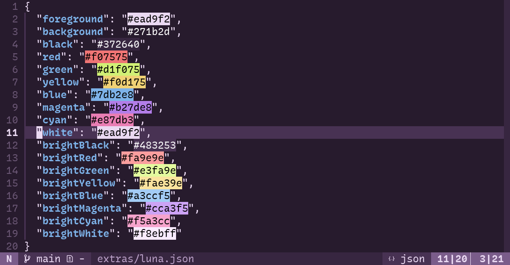

# luna.nvim

a neovim colorscheme descended from [fairyfloss](https://github.com/sailorhg/fairyfloss) and sister to [moonqueen.nvim](https://codeberg.org/sailorfe/moonqueen.nvim). built with [lush](https://github.com/rktjmp/lush.nvim).

<div align="center">



</div>

<!-- toc -->

- [palette](#palette)
- [features](#features)
- [installation](#installation)
    * [lua](#lua)
    * [vimscript](#vimscript)
- [contributing](#contributing)
    * [adding plugins](#adding-plugins)
    * [adding ports](#adding-ports)
- [acknowledgments](#acknowledgments)

<!-- tocstop -->

this repository is mirrored to [github](https://github.com/sailorfe/luna.nvim) from [codeberg](https://codeberg.org/sailorfe/luna.nvim).

## palette

| key     | hex       |
| ------- | --------- |
| base    | `#271B2D` |
| surface | `#372640` |
| overlay | `#483253` |
| text    | `#EAD9F2` |
| light   | `#F8EBFF` |
| mars    | `#F07575` |
| jupiter | `#D1F075` |
| venus   | `#F0D175` |
| mercury | `#7DB2E8` |
| saturn  | `#B27DE8` |
| moon    | `#E87DB3` |
| low     | `#291D2F` |
| med     | `#523C5D` |
| high    | `#7A5C8A` |

## features

- **supported neovim plugins**:
  - [gitsigns.nvim](https://github.com/lewis6991/gitsigns.nvim)
  - [mini.nvim](https://github.com/nvim-mini/mini.nvim) diff, statusline, and tabline
  - [render-markdown.nvim](https://github.com/MeanderingProgrammer)
  - [trouble.nvim](https://github.com/folke/trouble.nvim)
- **current ports** under `extras/`:
  - [alacritty](https://alacritty.org)
  - [foot](https://codeberg.org/dnkl/foot)
  - [termux](https://termux.dev)
  - `tty` for the console
  - [vim](https://www.vim.org)
  - [wezterm](https://wezterm.org)

## installation

### lua

with lazy:

```lua
return {
    "https://codeberg.org/sailorfe/luna.nvim",
--    init = function()
--        vim.cmd.colorscheme("luna")
--    end,
}
```

alternately, you can skip `init = function()` and declare `vim.cmd.colorscheme('luna')` somewhere in your `init.lua` after plugin load.

### vimscript

with vim-plug:

```vim
Plug 'https://codeberg.org/sailorfe/luna.nvim', { 'as': 'luna', 'branch': 'main' }
```

or you can place `colors/luna.vim` anywhere in your runtimepath:

```sh
curl -LO https://codeberg.org/sailorfe/luna.nvim/raw/branch/main/extras/vim/luna.vim
```

then set colorscheme with `colorscheme luna` either in your `vimrc` or temporarily with a command:

```vim
" .vimrc
set background=dark
syntax on
colorscheme luna
```

## contributing

```sh
git clone https://codeberg.org/sailorfe/luna.nvim
cd luna.nvim
```

make pull requests to [codeberg](https://codeberg.org/sailorfe/luna.nvim/pulls).

### adding plugins

**requires [lush](https://github.com/rktjmp/lush.nvim) and [shipwright](https://github.com/rktjmp/shipwright.nvim).**

1. `nvim lua/luna/lush.lua`
2. `:Lushify`
3. append new highlight groups to the bottom of the table
4. `./build.sh lua`

> [!WARNING]
> make sure you _do not_ have luna installed from this repository while developing. point neovim or your plugin manager to your local clone or else shipwright will get lost.

### adding ports

theme generation is helped by the `Makefile` at project root.

1. create `templates/$APP.*`:
   - for hex codes prefixed with hashes (`#B27DE8`), use `[[key]]`. examples: `alacritty.toml`, `wezterm.toml`.
   - for hex codes _without_ hashes (`B27DE8`), use `{{key}}`. examples: `foot.ini`, `tty.conf`.
2. add the output path `$APP/luna.*` to the `outputs` dictionary in `scripts/generator.py`.
3. (optional) ensure `palette.json` is up to date: `make palette`.
4. run the python script: `make generate`.

## acknowledgments

- [fairyfloss](https://github.com/sailorhg/fairyfloss) for inspiring this journey into colorschemes to begin with, and the low-contrast, magical girl vibes
- [evangelion.nvim](https://github.com/xero/evangelion.nvim) for weeb + `build.sh` inspiration
- [tokyonight.nvim](https://github.com/folke/tokyonight.nvim) for repository structure
