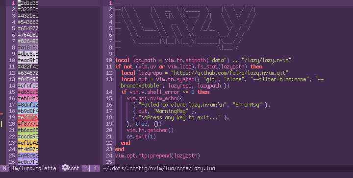

# luna.nvim

a pastel purple nvim colorscheme spiritually descended from [fairyfloss](https://github.com/sailorhg/fairyfloss) and the lighter, lower-contrast twin of [moonqueen.nvim](https://codeberg.org/sailorfe/moonqueen.nvim). currently ported for alacritty, foot, and wezterm.

<div align="center">

</div>

- <a href="#installation">installation</a>
- <a href="#extras">extras</a>
- <a href="#acknowledgments">acknowledgments</a>

this repository is mirrored to [github](https://github.com/sailorfe/luna.nvim) from [codeberg](https://codeberg.org/sailorfe/luna.nvim).

<a name="installation"></a>
## installation

### lua

with lazy:

```lua
return {
    "sailorfe/luna.nvim",
    opts = {
        -- transparent = false,
        -- overrides = false,
    },
    init function()
        vim.cmd.colorscheme("luna")
    end,
}
```

### vimscript

the easiest method is probably just to run curl from your n/vim `colors` directory:

```sh
curl -LO https://codeberg.org/sailorfe/luna.nvim/raw/branch/vim/colors/luna.vim
```

then set colorscheme with one of the folowing:

- `init.lua`: `vim.cmd.colorscheme("luna")`
- `.vimrc`: `set colorscheme "luna"`
- the command  `:colorscheme luna`

<a name="extras"></a>
## extras

there is an `extras/` dir with ports for

- `alacritty`, `foot` and `wezterm`: what i alternate between in [my sway setup](https://codeberg.org/sailorfe/dots)
- `termux`: may lag behind a bit
- `tty`: plain bash colors for the console

`luna.json` is included to in case you want to port this theme to whatever emulator you use. if you do, please make pull request!

<a name="acknowledgments"></a>
## acknowledgments

- [evangelion.nvim](https://github.com/xero/evangelion.nvim) for entire chunks of lua and weeb inspiration
- [tokyonight.nvim](https://github.com/folke/tokyonight.nvim) for dir structure
